# GAMEWORLD

**GAMEWORLD** Application repository: <https://github.com/infoshareacademy/jfdzr3-projects-game-over>.

**GAMEWORLD** Application website: <https://gameworld-a20b3.web.app/>.

## About

GAMEWORLD is a web application developed in ReactJS using Firebase. The information about the games was taken from the IGDB
API: [IGDB API](https://api-docs.igdb.com/#about). Our application is a website about. This is where users can read about
games in articles and on game pages. Users can also create articles, post comments and rate games if they log in.

This is a project developed during a 6-months long "Junior Frontend Developer" bootcamp organized by InfoShare Academy. The
main goal of the project was to create a complex ReactJS web application using knowledge gained during the course.

It was created by a team of 4 people:

- [Paulina Milewska](https://github.com/PaulinaMilewska)
- [Michał Radomski](https://github.com/Michal-Radomski)
- [Paweł Madrak](https://github.com/pawel-madrak)
- [Piotr Żak](https://github.com/piotrekzak-source)

### Features

What you can do using the **GAMEWORLD** app:

1. Sign up and create your profile

   - create your account using Firebase Authentication
   - then you can see your data in User profile: name, email, gender
   - you can see your account ID and permissions: admin / user
   - there is some information about your hardware
   - there is also geolocation (based on fetching data): you can see your IP address, city and country

   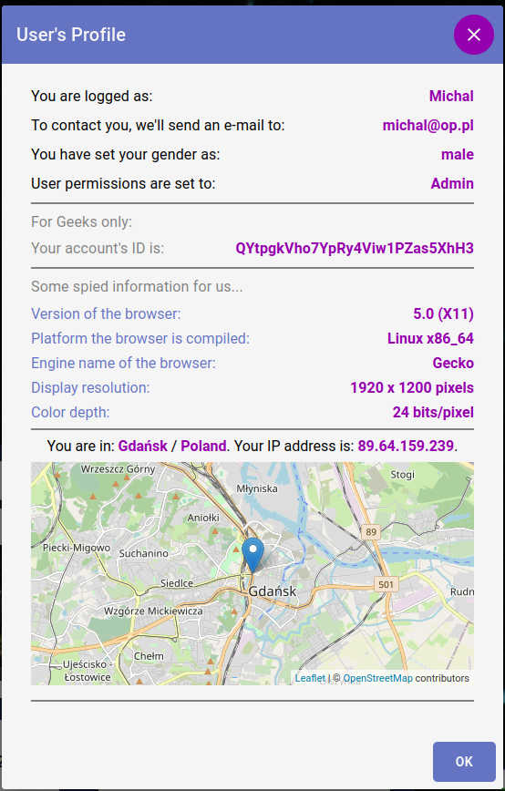

   - if you are the administrator you have access to the admin panel **_(this is demo, so emails are fake)_**

   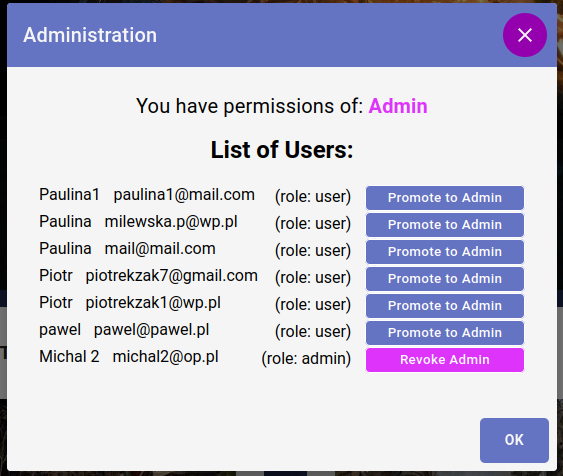

2. Read the latest articles and information about top games - Homepage:

   - you can easily reach the content of the article by clicking on the selected article on the autoplay carousel
   - you can see top rating games in Top game section. When you click on the game field, the game card will be displayed

   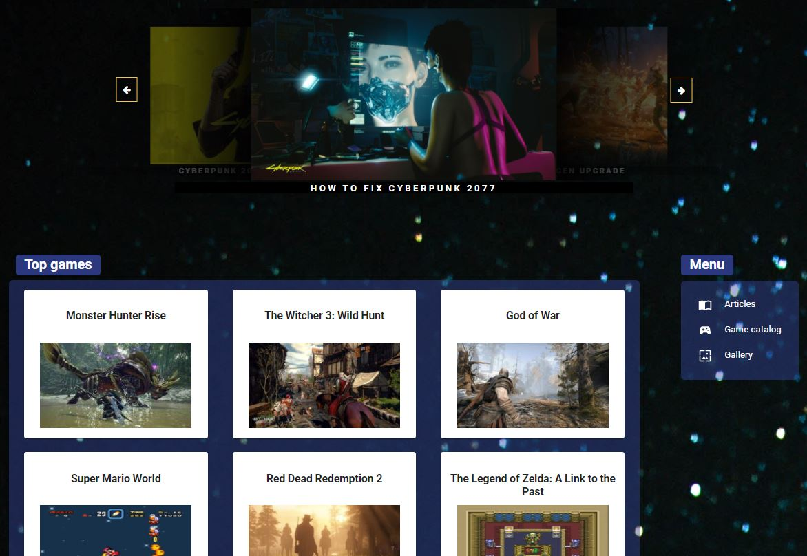

3. Sort and filter games in Game catalog:

   - when you click on link "Game catalog" in menu you can see list of all games in our catalog
   - you can sort games by rating, release date and follows count
   - you can find your favorite games by filtering them by platform and genre. You can also only view games that contain
     video.
   - all filters and sort work together. When you click on the game field, the game card will be displayed.

   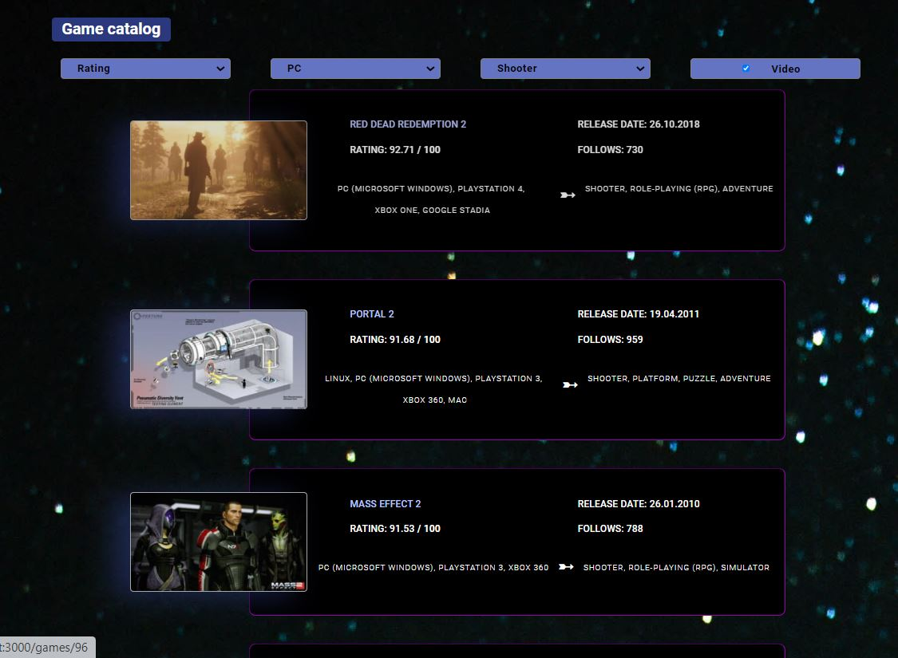

4. Read about the game on the game page:

   - you can check game information such as: created date, first release date, genres, platforms, game engine and IGDB
     statistics: rating, number of ratings and number of follows
   - you can read description and storyline
   - you can see game screenshots. After clicking on the thumbnail you can see a big image
   - you can watch video abut game (YouTube embed)

   

   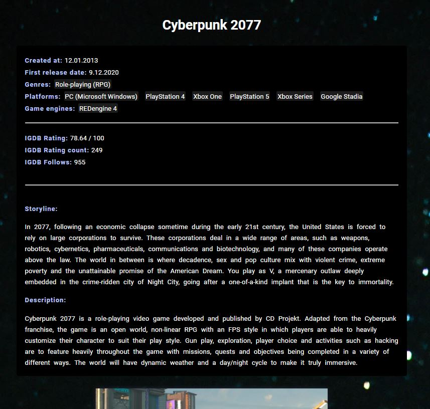
   
   

5. See the photo gallery:

   - when you click on link "Gallery" in menu you can see list of the games screenshots
   - after clicking on the thumbnail you can see a big image

   

   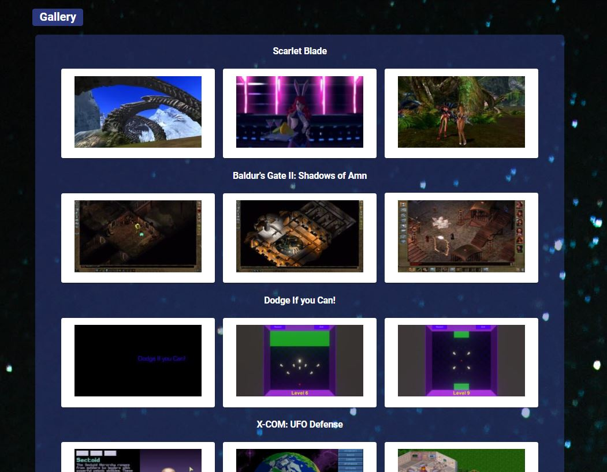
   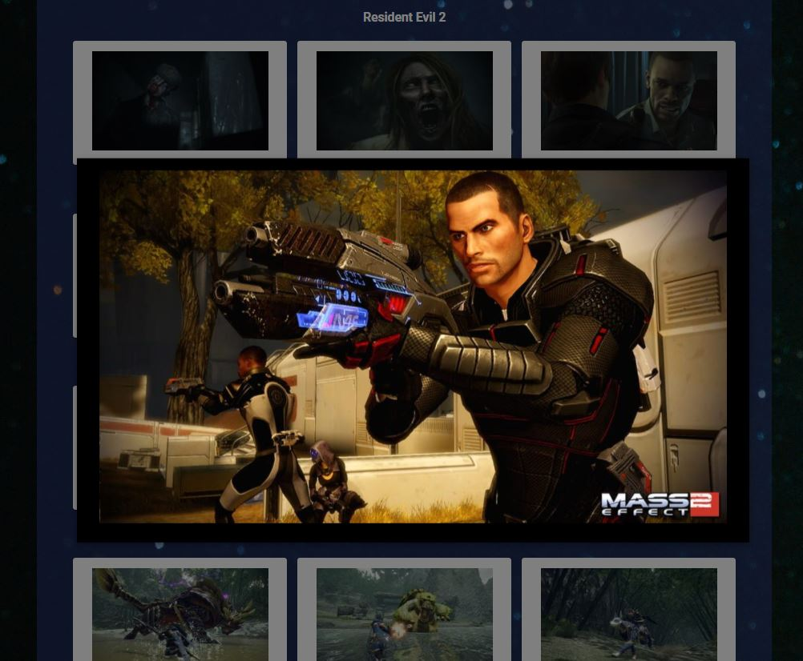
   

6. Search games and articles:

   - when you write the phrase in search bar in menu and click Enter tab you can find games and articles include search
     phrase
   - results are divided into two sections: games and articles
   - when you click in selected game or article you can read more on the game page or article page

   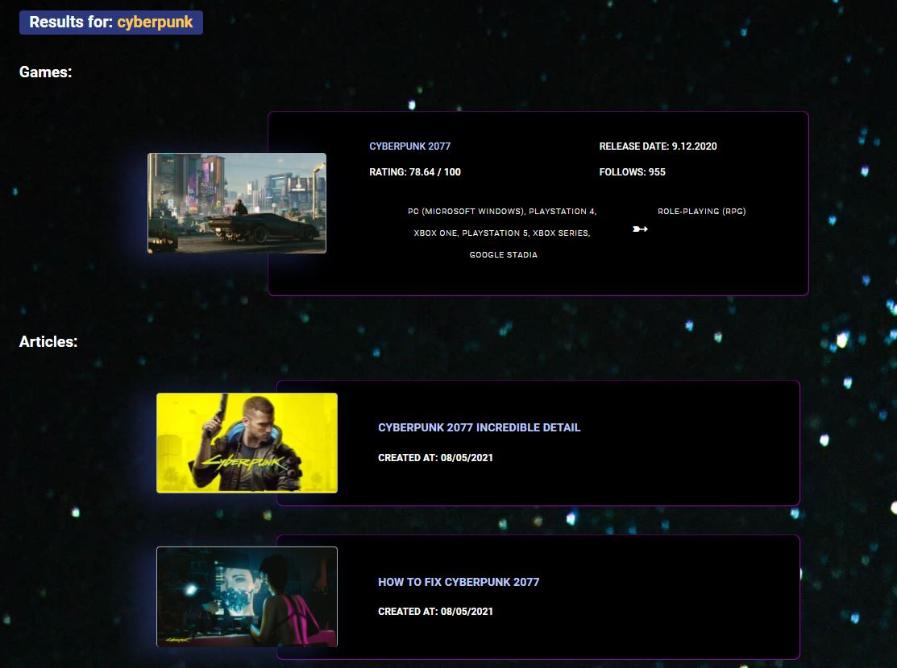

7. Create posts and react on other users' posts

   - you can create posts that will be visible to all users
     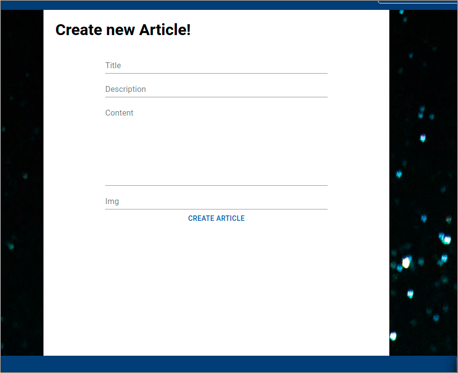
   - then you can go to Your Posts section to see all posts created by you and delete the ones you no longer want to be on
     the main page 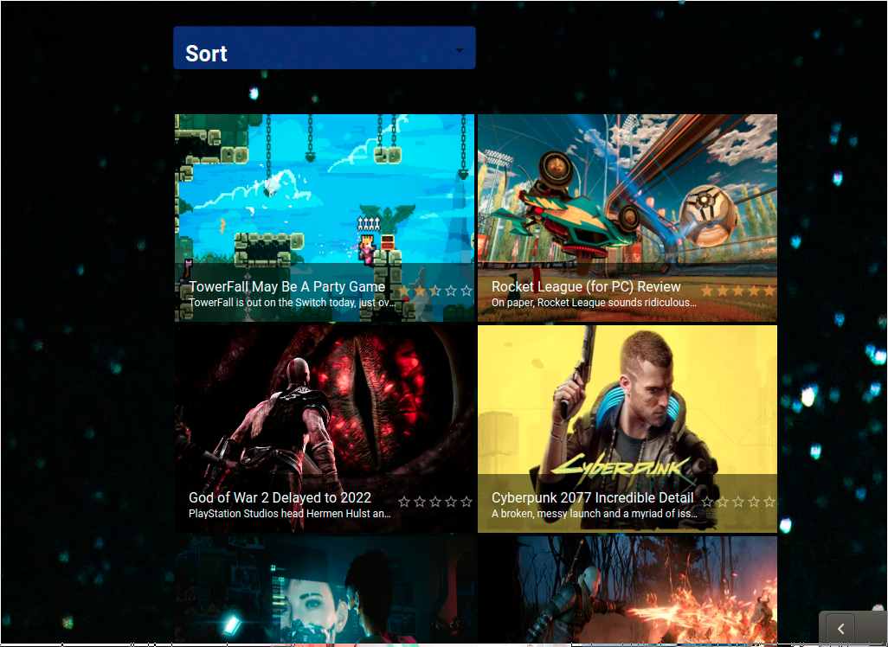
   - you can comment and rate with stars on posts created by other users

   

   
   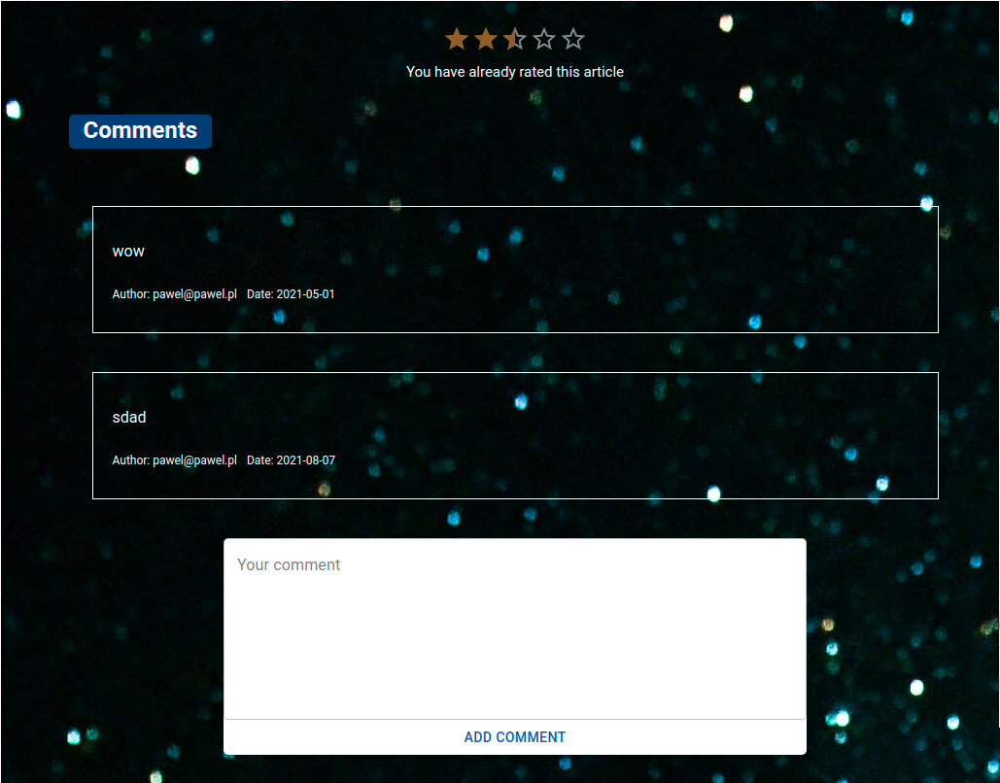
   

8. Create footer,subpages and contact form:
   - Creation of the project footer with buttons from the material UI leading to subpages
   - Creation of a subpage with information about the project creators
   - Creation of a subpage with contact form for users. The form sends data to firebase database, then messages are presented
     on the subpage messages
   - Creation of messages subpage 
     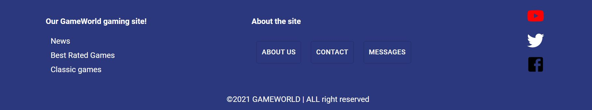
     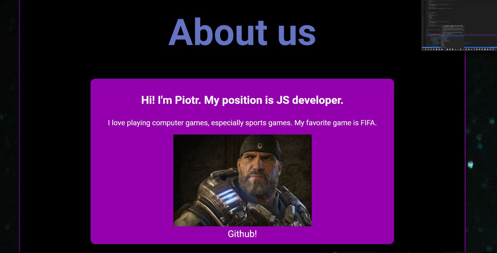

### Environment, backend & deployment

GAMEWORLD web application was written in ReactJS. We developed it using React Hooks: useState for app state management,
useEffect for fetching data and other.

Backend features were implemented using Firebase. We used Firestore Database to store data: users and their data, posts with
comments and likes. Authentication allowed us to create sing up & log in system.

GAMEWORLD has been deployed via Firebase Hosting: <a href="https://gameworld-a20b3.web.app/" target="_blank">**link to the app page**</a>.

### Notes, ToDo List & Issues

1. 3d-react-carousal will be replaced with a different library.

### Built With

- [React](https://reactjs.org/) - building user interfaces,
- [React Router](https://reactrouter.com/) - declarative routing for React,
- [React Icons](https://react-icons.github.io/react-icons) - to include popular icons in a React project,
- [React Query](https://react-query.tanstack.com/) - fetching, caching for React,
- [React Swipeable Views](https://react-swipeable-views.com/) - component for swipeable views in React,
- [React Hook Form](https://react-hook-form.com/) - forms for React,
- [Material-UI](https://material-ui.com/) - most elements of the UI,
- [Styled Components](https://styled-components.com/) - component for styling the application,
- [Firebase JavaScript SDK](https://firebase.google.com/docs/reference/js) - SDK of Firestore,
- [Leaflet](https://leafletjs.com/) - rendering a map.

### Feedback

If you have any comments on this project feel free to leave them in issues or contact us via GitHub.

### Thanks

We wanted to thank our trainers <a href="https://github.com/cytrowski">@cytrowski</a> and
<a href="https://github.com/jan-hanc-iShare">@jan-hanc-iShare</a> from
<a href="https://github.com/infoshareacademy">infoShare Academy</a> for all the help and support they gave us during this
project.

### License

[MIT](https://choosealicense.com/licenses/mit/)
